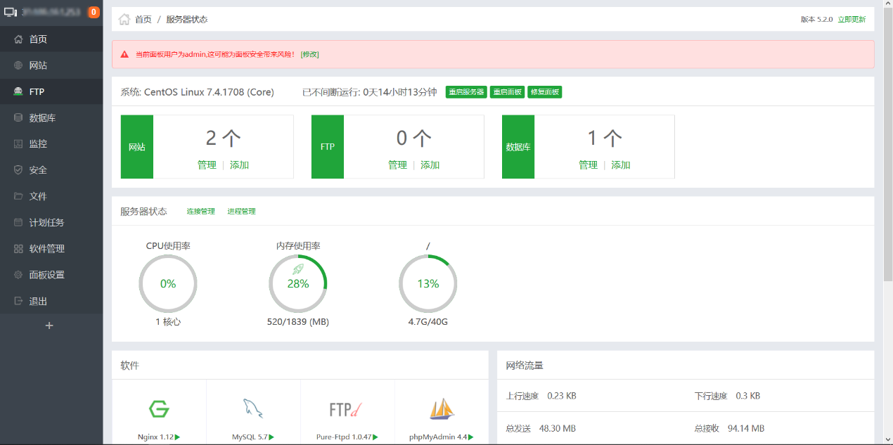
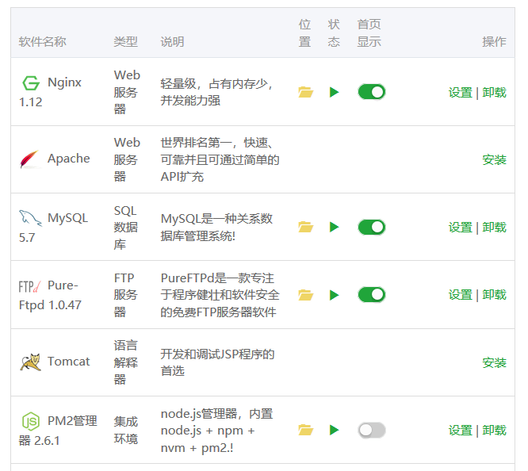
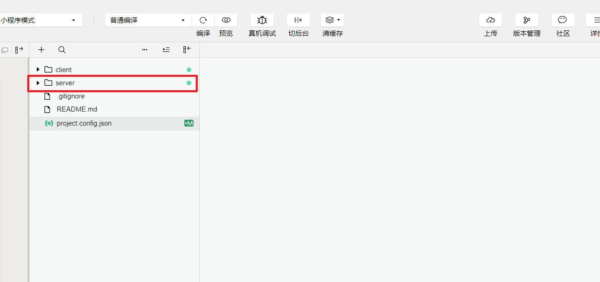
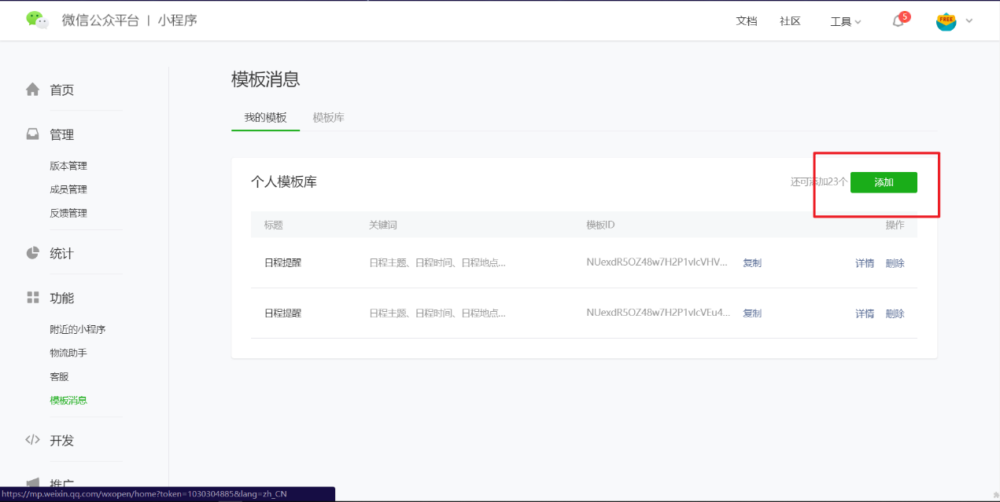
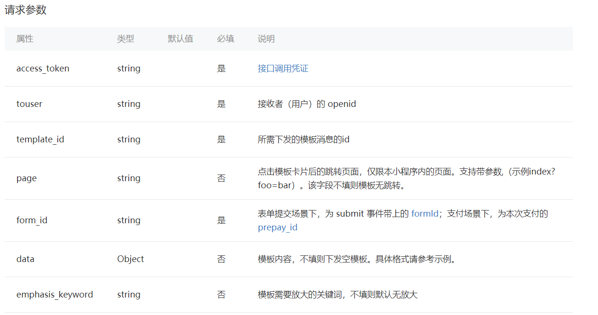

<<<<<<< HEAD
Wafer2小程序解决方案使用过程
----------------------------

在开发前建议到网上下一些现成的demo

用微信开发者工具打开后大致看一下，能理解多少就理解多少

觉得不理解的就先上开发者文档上看看：

<https://developers.weixin.qq.com/miniprogram/dev/>

而在开发初期主要了解

开发者工具部分
--------------


一个页面的完成主要包括四个文件.json、.wxml、.wxss、.js文件

#### Wxml、wxss文件

顾名思义wxml文件等同于web开发中的html文件

Wxss文件等同于css文件

这两个文件可以看作视图层

可参考文档：

<https://developers.weixin.qq.com/miniprogram/dev/framework/view/>

Wxml的组件使用可以参考：

<https://developers.weixin.qq.com/miniprogram/dev/component/>

这些组件就相当与html中的\<p\>\</p\>\<div\>\</div\>这些

具体的使用方法可以就要看文档啦

#### Js文件可以看作事件处理的文件

这个js文件的作用可以看文档：

<https://developers.weixin.qq.com/miniprogram/dev/framework/app-service/page.html>

其中需要重点了解的是

生命周期回调函数和组件事件处理函数这两个部分

还有一个js文件使用的比较多的就是微信小程序API，可参考

<https://developers.weixin.qq.com/miniprogram/dev/api/>

#### json文件

其中json文件不需要多说，这个文件的作用可以忽略，当需要的话，看文档：

<https://developers.weixin.qq.com/miniprogram/dev/framework/config.html>

但是不同于web开发中各个文件之间需要引用才能使用

微信小程序开发中只要在一个文件夹中

比如create文件中

这四个文件不需要添加引用语句就可使用

了解完这些回头再看看demo看看能理解多少

这个时候就可以去着手进行自己的小程序开发了

其实在看文档的时候就可以自己创建一个项目，按着文档做一些简单的东西

### 微信开发者工具的使用：

<https://developers.weixin.qq.com/miniprogram/dev/devtools/devtools.html>

//git clone https://github.com/Topdu/my-wxxiaochengxu.git

### 最简版的 Wafer2 开发套件

Github：<https://github.com/tencentyun/wafer2-quickstart-nodejs>

使用方法上面都有这里不再赘述

### [./media/image3.png](./media/image3.png)

下面直接进入项目的后端说明：


看一下目前这个项目的内容

### Client 这个文件夹下主要进行视图页面的开发：可以说是前端的开发吧


### Server这个文件夹下进行服务端的开发，就是后端的开发

腾讯发布的这一套解决方案这一点比较好，前端后端在一起开发，不过要注意修改后端，也就是CGI（注意文档CGI的使用方法）修改后要进行上传代码到腾讯服务器，这个意思就是说，现在你可以在自己电脑上进行后端开发，但是要使用后端，要把自己的后端代码上传到腾讯服务器，具体方法

Github：<https://github.com/tencentyun/wafer2-quickstart-nodejs>

这里面都有

进行后端开发的时候，最经常打交道就是数据库了

### 后端数据库的连接

进入到自己phpmyadmin，看看方案给出的数据库是什么样


怎么进入phpmyadmin，要开通腾讯云


点击后台管理，进入


看到


点击进入，建议用ie浏览器进入


初始密码为自己小程序的appid 点击执行进入


cAuth这个数据库就是方案给出的数据库

以后设计数据库就可以在这里设计啦

### 回到微信开发者工具连接数据库


这部分就是与数据库进行连接的部分

连接具体方法可以看

Github：<https://github.com/tencentyun/wafer2-quickstart-nodejs>

其中关于数据库的部分，如果还是不清楚使用方法，这里给一个demo做参考：

Github：<https://github.com/goolhanrry/Weapp-Demo-LemonJournal>

主要可以看一下这个后端部分server/controllers下的js文件，也就是怎么进行数据库查询，修改，增加，删除，这些操作

### 添加CGI

这里说明一下在进行server/controllers文件夹js开发时，要进行几个步骤，可以参考CGI的步骤：


首先在client/下的config.js文件夹中添加

对应controllers文件夹下的js文件


然后在server/routes/index.js文件中进行加入一些东西。对应controller文件下的js文件

**注意：**

**router.post('/\*\*, controllers.\*\*)的用法**

**router.post的post。这个post或者get对应we.request，method:’POST’或者’GET’**


**不能弄混！！**


使用这些接口之前要在JS文件头加上：
```javascript
 var qcloud = require('../../vendor/wafer2-client-sdk/index')

 var config = require('../../config')

 var util = require('../../utils/util.js')
```
后端开发就先说这么多

前端的话真没什么要说的，一些组件的使用就要自己开动脑筋进行设计啦，当然可以看看别人的轮子，进行修改，然后自己进行创新。

Wafer2小程序解决方案使用过程（自行部署DEMO使用阿里云服务器搭建微信小程序后台环境）：
------------------------------------------------------------------------------------

### 服务器环境：

使用阿里云轻量应用服务器：

CentOS 7.3 64位操作系统1核2GB内存40GB系统盘SSD

安装面板应用BT-Panel 5.2.0（宝塔Linux面板）


使用宝塔面板之前首先要对服务器的防火墙进行添加规则：

建议上面的几个端口全部添加到规则里面。

### 宝塔控制面板



然后再浏览器里面输入 你的外网ip:8888 即可进行宝塔控制面板：

图1


（如果不知道怎么安装宝塔面板，建议直接重置阿里云轻量应用服务器）：

图2

直接重置为BT-Panel 5.2.0

进入操作面板（图1）

### [./media/image22.png](./media/image22.png)



安装应用（注意版本）：

Apache和Tomcat不用安装，只需安装Nginx、MySql、Pure-Ftpd、PHP、PM2管理器

安装好后，点击操作面板左侧菜单栏 网站

### [./media/image24.png](./media/image24.png)

添加站点

所以看到添加网站的时候，默认要对服务器购买域名

购买域名后，进行备案，这个过程就不多说了

添加好了站点，可以在浏览器中输入自己的域名测试一下站点是否成功，如果显示添加站点成功等字样即表示添加站点成功了。这个时候就可以开发自己的站点了。

我要做的就是为小程序搭建一个后台环境

上面做的那些只是搭建了一个基本的服务器站点。

### 搭建小程序后台环境

首先要对自己的服务器配置ssl证书，因为小程序要求serverhost要为https

### SSL证书

我用了阿里云的免费证书


<https://common-buy.aliyun.com/?spm=5176.2020520154.cas.1.577fZ1YDZ1YDXb&commodityCode=cas#/buy>


等待审核签发后，

下载证书：


由于前面配置的Nginx（小程序要用到node.js，所以一般都是用Nginx）的wed服务器，所以下载Nginx对应的证书

给出腾讯官方的文档：自行部署 Node.js Demo

<https://cloud.tencent.com/document/product/619/11445>

看了我这篇文档腾讯的官方文档只做一个参考，如果你按照我的步骤出现了，就要去看看腾讯的官方文档，进行参考一下

### 配置 Nginx 和 HTTPS

下载完了证书要将证书上传到服务器，我是上传到了Nginx的安装目录里面


使用宝塔操作面板：查看Nginx的安装目录

点击上面的文件图标即可进入Nginx的安装目录


打开conf文件夹

然后新建文件夹cert（注意这个文件夹的名称要用于下面的nginx.conf配置文件，如果你修改了这个文件夹名称，配置文件也要做相对应的修改）


新建cert文件夹后，进入cert文件夹（这些操作直接全部可以在宝塔操作面板上完成，不用远程连接服务器），然后将刚才下载的两个证书文件（.key和.pem）上传到cert文件夹下面

这个是就要修改nginx.conf文件了：


打开/www/server/nginx/conf/下的nginx.conf文件：

在 include /www/server/panel/vhost/nginx/\*.conf; 前面添加：
```json
upstream app_weapp {
    server localhost:5757;
    keepalive 8;
} 
server {
    listen      80;
    server_name www.域名.cn;
 
    rewrite ^(.*)$ https://$server_name$1 permanent;
} 
server {
    listen      443;
    server_name www.域名.cn;
    ssl on;
  root /www/wwwroot/www.域名.cn;
    index  index.php index.html index.htm ;
 include enable-php.conf;
  ssl_certificate  cert/1788210_域名.cn.pem;
    ssl_certificate_key cert/1788210_域名.cn.key;
    ssl_session_timeout       5m;
    ssl_protocols             TLSv1 TLSv1.1 TLSv1.2;
    ssl_ciphers               ECDHE-RSA-AES256-GCM-SHA384:ECDHE-RSA-AES128-GCM-SHA256:DHE-RSA-AES256-GCM-SHA384:ECDHE-RSA-AES256-SHA384:ECDHE-RSA-AES128-SHA256:ECDHE-RSA-AES256-SHA:ECDHE-RSA-AES128-SHA:DHE-RSA-AES256-SHA:DHE-RSA-AES128-SHA;
    ssl_session_cache         shared:SSL:50m;
    ssl_prefer_server_ciphers on;
 location ~ \.php{
            root /www/wwwroot/www.域名.cn;
            fastcgi_pass   127.0.0.1:9000;
            fastcgi_index  index.php;
            fastcgi_param  SCRIPT_FILENAME  /www/wwwroot/www.域名.cn$fastcgi_script_name;
            fastcgi_split_path_info ^(.+\.php)(.*)$;    
            fastcgi_param PATH_INFO $fastcgi_path_info;  
            include        fastcgi_params;
            fastcgi_param HTTPS on; 
        }
    location / {
 index  index.php index.html index.htm;
        proxy_pass http://app_weapp;
        proxy_http_version 1.1;
        proxy_set_header Upgrade $http_upgrade;
        proxy_set_header Connection 'upgrade';
        proxy_set_header Host $host;
        proxy_cache_bypass $http_upgrade;
    }
}
```


其中这个是你的站点安装目录也要修改为你自己的站点安装目录，也就是前面添加站点的安装目录：

还有**ssl_certificate cert/1788210_域名.cn.pem;**

**ssl_certificate_key cert/1788210_域名.cn.key;**

这两句，就是两个证书文件的位置，刚才前面将两个文件放到了cert文件夹下，而这个配置文件nginx.conf是cert文件夹在同一个文件夹下面，所以要配置好文件的路径。


这个配置好，重启Nginx：

重启成功后就表示配置成功啦，如果配置错误，Nginx重启时会报错误，根据错误去找错误原因，然后再重启nginx。

下面就是要将小程序的后台文件上传到服务器上面了：

### 下载wafer2

<https://github.com/tencentyun/wafer2-quickstart-nodejs>

根据里面文档进行配置

用微信开发者工具打开wafer2-quickstart-nodejs



我们要上传到服务器上的只有server这一部分：


其中node_modules不用上传，这个是安装的部署依赖，然后将其他文件上传到/www/wwwroot/www.域名.cn/weapp文件夹下面


/www/wwwroot/www.域名.cn这个是你自己的站点安装目录，如果安装目录下面没有weapp文件夹就新建
weapp文件夹（weapp文件夹的名称不能改），然后将server文件夹下的文件（除了node_modules）上传到weapp文件夹下面：

建议使用FileZilla、Transmit 等 FTP 工具连接上服务器然后上传上面的文件

然后配置weapp/文件夹下的config.js文件：
```json
const CONF = {
    port: '5757',
    rootPathname: ' /www/wwwroot/www.域名.cn/ ',//修改为自己的站点目录

    // 微信小程序 App ID
    appId: '',

    // 微信小程序 App Secret
    appSecret: '',

    // 是否使用腾讯云代理登录小程序
    useQcloudLogin: false,

    /**
     * MySQL 配置，用来存储 session 和用户信息
     * 若使用了腾讯云微信小程序解决方案
     * 开发环境下，MySQL 的初始密码为您的微信小程序 appid
     */
    mysql: {
        host: 'localhost',
        port: 3306,
        user: 'root',
        db: 'cAuth',//数据库名字不能变
        pass: '云数据库密码',//可在宝塔操作面板数据库创建
        char: 'utf8mb4'
    },

    cos: {
        /**
         * 区域
         * 华北：cn-north
         * 华东：cn-east
         * 华南：cn-south
         * 西南：cn-southwest
         * 新加坡：sg
         * @see https://cloud.tencent.com/document/product/436/6224
         */
        region: 'cn-south',
        // Bucket 名称
        fileBucket: 'qcloudtest',
        // 文件夹
        uploadFolder: ''
    },

    // 微信登录态有效期
    wxLoginExpires: 7200,

    // 其他配置 ...
    serverHost: '你的域名',
    tunnelServerUrl: 'http://tunnel.ws.qcloud.la',
    tunnelSignatureKey: '27fb7d1c161b7ca52d73cce0f1d833f9f5b5ec89',
      // 腾讯云相关配置可以查看云 API 密钥控制台：https://console.cloud.tencent.com/capi
    qcloudAppId: '你的腾讯云 AppID',
    qcloudSecretId: '你的腾讯云 SecretId',
    qcloudSecretKey: '你的腾讯云 SecretKey',
    wxMessageToken: 'weixinmsgtoken',
    networkTimeout: 30000
}

module.exports = CONF
```

### 安装依赖

这个时候通过阿里云远程连接连接到服务器，然后切换到root账户登录

然后 cd /www/wwwroot/www.域名.cn/weapp/

在weapp目录下面

输入以下命令切换 npm 源到腾讯云镜像，防止官方镜像下载失败：
```
npm config set registry http://mirrors.tencentyun.com/npm/
```
接着安装全局依赖：
```
npm install -g pm2
```
然后安装本地依赖：
```
npm install
```


接着对数据库进行初始化，在宝塔登录面板中创建数据库：


输入数据库名为 cAuth，排序规则为 utf8mb4_unicode_ci，创建数据库：

接着返回远程连接，使用 Demo 代码里的 tools/initdb.js 工具

### 初始化数据库：
```
node tools/initdb.js
```
初始化成功则会提示“数据库初始化成功！”

接着执行如下代码

### 启动 Node.js
```
node app.js
```
这个使用远程连接开启node.js进程后，如果管理远程连接，node.js进程就会关闭，因为想要小程序后台环境一直运行，app.js就要一直运行，所以使用下面的方法进行操作：

连接阿里云服务器，启动nodejs服务，客户端掉线，服务也会终止。如何在客户端掉线的情况下，node服务正常运行？

#### Forever：

forever是一个nodejs守护进程，完全由命令行操控。forever会监控nodejs服务，并在服务挂掉后进行重启。

#### forever安装
```
npm install -g forever
```
#### forever使用
```
forever start app.js //index.js是你要启动的js文件

forever list //会列出forever正在运行的服务脚本

forever stop app.js //停止服务运行
```
查看帮助信息：
```
forever --help
```
### 完成

顺利完成以上操作，就完成了 Wafer Demo 在自己服务器上的部署。直接访问
http://你的域名/weapp/login，会提示：
```
{"code":-1,"error":"ERR_HEADER_MISSED"}
```
则表示配置成功。你现在可以使用开发者工具来进行联调测试啦！


配置好服务端下面就是客户端：

将client下面的config.js文件中的host改成自己的域名。

### 测试


在微信开发者工具模拟器中点击【测试登录接口】，看到显示“登录成功”，即为开通完成，可以开始你的其他开发了。

微信小程序模板消息开发（使用php实现后端，用户设置时间定时接收消息，后端定时发送服务通知）
-----------------------------------------------------------------------------------------

实现功能：用户设置任务提醒时间，后台存储用户信息以及任务消息，根据用户设置的时间发送微信服务通知：


### access_token

首先要获取接口调用凭证access_token

<https://developers.weixin.qq.com/miniprogram/dev/api/getAccessToken.html>

我是使用php进行的接口调用：
```php
$url='https://api.weixin.qq.com/cgi-bin/token?grant_type=client_credential&appid=你的APPID&secret=你的' appSecret;
        $curls = curl_init();
        curl_setopt($curls, CURLOPT_URL, $url);
        curl_setopt($curls, CURLOPT_SSL_VERIFYPEER, FALSE);
        curl_setopt($curls, CURLOPT_SSL_VERIFYHOST, FALSE);
		curl_setopt($curls, CURLOPT_SSLVERSION, 1);
        curl_setopt($curls, CURLOPT_POSTFIELDS,1);
        curl_setopt($curls, CURLOPT_RETURNTRANSFER, 1);
        $output = curl_exec($curls);
        if (curl_errno($curls)) {
            echo 'Errno'.curl_error($curls);//捕抓异常
        }
        curl_close($curls);
		$result =  $output;
$results=(json_decode($result, true));
					//	 echo $results["access_token"];
					$access_token=$results["access_token"];
```

最后\$access_token就是请求的到的接口调用凭证access_token。

### 模板id

还要设置模板id ：template_id



模板id可以到微信公众凭条小程序设置：


然后选用自己合适的模板：


设置好后在个人模板库里面即可查看模板id：

这个是再看看小程序文档：

<https://developers.weixin.qq.com/miniprogram/dev/api/sendTemplateMessage.html>

### sendTemplateMessage



其中请求参数**access_token**前面已经得到；

**template_id**直接复制用到后端服务器；

**Touser**是用户的openid，通过这个openid，服务器可以发给这个openid的用户，只要用户同意授权登录小程序，即可获得用户的openid；


**Page** 是路径设置，即当用户点击服务通知卡片进入的小程序界面：  
通过这个路径可以控制用户进入小程序时首先展示的界面。

**Form_id**时用户在进行form标签提交的时候，得到的参数，详细的设置可以参考官方文档：

<https://developers.weixin.qq.com/miniprogram/dev/component/form.html>

当用户点击提交按钮时，会自动获得一个form_id


比如：


通过testSubmit事件触发函数接收form_id

得到这些参数后，通过请求后台php文件，将这些参数信息存储到后台数据库
```javascript
wx.request({
      url: 'http://外网ip/insert_remind.php',//这个php文件接收下面的信息将信息存到数据库中
      data:
      {
        touser: "",//用户openid
        template_id: '',//模板ID
        form_id: ,//得到的form_id
        page: "pages/schedule/schedule",
        remind_time: remind.getTime(),//用户设置 的提醒时间
        keyword1:,
        keyword2:,
        keyword3:,
        keyword4:,
        keyword5:,//这几个keywords就是服务通知的信息
      },
      method: 'GET',
      header: {
        "Accept": "application/json"
      },
      success: function (res) {

        console.log("request successed !")
            },
      fail: function (err) {
        console.log('request fail ', err);
      
      complete: function (res) {
        console.log("request completed!");
      }

})
```

然后通过后台设置send_remind.php文件，再将这些存储到数据库的信息读出，判断当前时间是否到了用户设置提醒时间，如果到了，就请求发送模板消息接口（sendTemplateMessage），发送模板消息。

#### Insert_remind.php
```php
<?php
ini_set("error_reporting","E_ALL & ~E_NOTICE");
$touser=$_GET['touser'];//$_POST["touser"];
$template_id=$_GET['template_id'];//$_POST["template_id"];
$form_id=$_GET['form_id'];//$_POST["form_id"];
$page=$_GET['page'];//$_POST["page"];
$remind_time=$_GET['remind_time'];
$key1=$_GET['keyword1'];
	
$key2=$_GET['keyword2'];

$key3=$_GET['keyword3'];

$key4=$_GET['keyword4'];

$key5=$_GET['keyword5'];

$mysql_server_name = 'localhost';
$mysql_username = 'root';
$mysql_password = '';
$mysql_database = 'cAuth';//hjxt

//创建连接
$conn = mysqli_connect($mysql_server_name,$mysql_username,$mysql_password);
//check connection
if (!$conn){
    die('连接失败：'.mysqli_error());
}
mysqli_query($conn, "set names 'utf8'");
mysqli_select_db($conn, $mysql_database);

$sql = "insert into message_remind (open_id,remind_time,form_id,key1,key2,key3,key4,key5)values('$touser','$remind_time','$form_id','$key1','$key2','$key3','$key4','$key5')";
mysqli_query($conn, $sql);

mysqli_close($conn);
?>
```
#### Send_remind.php：
```php
<?php
ini_set("error_reporting","E_ALL & ~E_NOTICE");
     
$mysql_server_name = 'localhost';
$mysql_username = 'root';
$mysql_password = '';
$mysql_database = 'cAuth';//hjxt

//创建连接
$conn = mysqli_connect($mysql_server_name,$mysql_username,$mysql_password);
//check connection
if (!$conn){
    die('连接失败：'.mysqli_error());
}
mysqli_query($conn, "set names 'utf8'");
mysqli_select_db($conn, $mysql_database);


$remind_time=((int)time());
$sql1 = "SELECT * FROM `message_remind` where or_remind=0";
$results1 = mysqli_query($conn, $sql1);
$row1 = $results1->fetch_all();
 $num=mysqli_num_rows($results1);

if($num==0)
{
	echo "没有需要发送的消息";
}
else
{
for($n=0;$n<$num;$n++)
{
if((($row1[$n][2]))<=($remind_time*1000))
{
$sql = "SELECT * FROM `access_token`";
$results = mysqli_query($conn, $sql);
$row = $results->fetch_all();
$data = json_encode($row);
$id=$row1[$n][1];
if(((int)$row[0][1]+7200)<((int)time()))
{
	$url='https://api.weixin.qq.com/cgi-bin/token?grant_type=client_credential&appid=wxb648d10457bb1a9f&secret=cd73a8a55866339f7047e578b4d2f7c5';
        $curls = curl_init();
        curl_setopt($curls, CURLOPT_URL, $url);
        curl_setopt($curls, CURLOPT_SSL_VERIFYPEER, FALSE);
        curl_setopt($curls, CURLOPT_SSL_VERIFYHOST, FALSE);
		curl_setopt($curls, CURLOPT_SSLVERSION, 1);
        curl_setopt($curls, CURLOPT_POSTFIELDS,1);
        curl_setopt($curls, CURLOPT_RETURNTRANSFER, 1);
        $output = curl_exec($curls);
        if (curl_errno($curls)) {
            echo 'Errno'.curl_error($curls);//捕抓异常
        }
        curl_close($curls);
		$result =  $output;
                if($result){
                    echo json_encode(array('state'=>5,'msg'=>$result));
					$results=(json_decode($result, true));
					//	 echo $results["access_token"];
					$access_token=$results["access_token"];
					$time=(string)time();
					$sql = "update access_token set access_token = '$access_token',time='$time' "; //VALUES ('$access_token', '$time')中的$access_token不能为$results["access_token"]的形式
					if (mysqli_query($conn, $sql)) { 
						echo "guoqi xinjilu".$access_token; 
						
					} else { 
						echo "Error: " . $sql . mysqli_error($conn); 
					} 
					
                }else{
                    echo json_encode(array('state'=>5,'msg'=>$result));
                }
}
else
{
	$access_token=$row[0][0];
	echo "weiguoqi".$row[0][0];
}


 $value = array(
              "keyword1"=>array(
			"value"=>$row1[$n][4],
			"color"=>"#4a4a4a"
                    ),
                    "keyword2"=>array(
			"value"=>$row1[$n][5],
                        "color"=>"#9b9b9b"
                    ),
                    "keyword3"=>array(

                        "value"=>$row1[$n][6],
			"color"=>"#9b9b9b"
                    ),
                    "keyword4"=>array(
                        "value"=>$row1[$n][7],
			"color"=>"#9b9b9b"
                    ),
                    "keyword5"=>array(
                        "value"=>$row1[$n][8],
                        "color"=>"#9b9b9b"
                    ),
                );
                
              
                $dd = array();
  
                $dd['touser']=$row1[$n][1];
                $dd['template_id']='NUexdR5OZ48w7H2P1vlcVHVERG09fXD8dX53bkd7-E8';
                $dd['page']="pages/schedule/schedule";  //点击模板卡片后的跳转页面，仅限本小程序内的页面。支持带参数,该字段不填则模板无跳转。
                $dd['form_id']=$row1[$n][3];
                
                $dd['data']=$value;                        //模板内容，不填则下发空模板
                
                $dd['color']='';                        //模板内容字体的颜色，不填默认黑色
           
                $dd['emphasis_keyword']='keyword3.DATA';
               // sleep(300);
     
               
    /* 发送json格式的数据，到api接口 -xzz0704  */
		$type='json';
        if($type=='json'){//json $_POST=json_decode(file_get_contents('php://input'), TRUE);
            $headers = array("Content-type: application/json;charset=UTF-8","Accept: application/json","Cache-Control: no-cache", "Pragma: no-cache");
            $data=json_encode($dd);
        }
	$urls='https://api.weixin.qq.com/cgi-bin/message/wxopen/template/send?access_token='.$access_token;
        $curl = curl_init();
        curl_setopt($curl, CURLOPT_URL, $urls);
        curl_setopt($curl, CURLOPT_POST, 1); // 发送一个常规的Post请求
        curl_setopt($curl, CURLOPT_SSL_VERIFYPEER, FALSE);
        curl_setopt($curl, CURLOPT_SSL_VERIFYHOST, FALSE);
        if (!empty($data)){
            curl_setopt($curl, CURLOPT_POST, 1);
            curl_setopt($curl, CURLOPT_POSTFIELDS,$data);
        }
        curl_setopt($curl, CURLOPT_RETURNTRANSFER, 1);
        curl_setopt($curl, CURLOPT_HTTPHEADER, $headers );
        $output = curl_exec($curl);
        if (curl_errno($curl)) {
            echo 'Errno'.curl_error($curl);//捕抓异常
        }
        curl_close($curl);
        	$results =  $output;
		$flag=json_decode($results ,true);
		if($flag['errmsg']=='ok')
		{
			$sql = "update message_remind set or_remind = 1 where id=$id"; //VALUES ('$access_token', '$time')中的$access_token不能为$results["access_token"]的形式
			if (mysqli_query($conn, $sql)) { 
				echo 'ok'; 
						
			} else { 
				echo "Error: " . $sql . mysqli_error($conn); 
			} 
		}
		else
			echo 'no';
                if($results){
                    echo json_encode(array('state'=>5,'msg'=>$results));
                }else{
                    echo json_encode(array('state'=>5,'msg'=>$results));
                }
 }
}
}
mysqli_close($conn);	
```

send_remind.php文件中实现了判断access_token
接口调用凭证是否过期，过期了会重新请求新的access_token，

下面给出涉及到两个数据库表的结构：


Access_token表：

创建access_token表后，进行预先插入一个记录，记录的值为（1,1）

Message_remind表：


这个表用于存储用户设置提醒任务信息。

### 定时发送模板消息：

前面说过，后台要检测数据库中的任务信息，如果当前时间到了用户设置的任务提醒时间，就请求发送模板消息接口（sendTemplateMessage），发送模板消息。

所以后台要一直检测数据库表message_remind 里的信息是否有符合发送条件的。

通过设置每分钟运行send_remind.php，来实现上面的功能：

使用crontab定时器工具来实现
```
  yum install crontabs  //安装
  systemctl enable crond  //设置开机启动crond服务
  systemctl start crond  //启动crond服务
  crontab -e  //编写
```


编写想要执行的脚本

添加上面展示的记录 其中\*/1 \* \* \* \*表示一分钟运行一次
/www/server/php/56/bin/php表示php安装目录下的php执行文件
/www/wwwroot/www.域名.cn/send_remind.php 表示要运行的文件

然后重启crond服务

>   systemctl restart crond

### 小程序前端代码

#### 小程序前端js代码：
```javascript
const app = getApp()
var date = new Date();
var currentHours = date.getHours();
var currentMinute = date.getMinutes();
Page({
  data: {
    multiArray: [['今天', '明天', '3-2', '3-3', '3-4', '3-5'], [0, 1, 2, 3, 4, 5, 6], [0, 10, 20]],
    multiIndex: [0, 0, 0],
  },
  onLoad: function () {
    console.log('代码片段是一种迷你、可分享的小程序或小游戏项目，可用于分享小程序和小游戏的开发经验、展示组件和 API 的使用、复现开发问题和 Bug 等。可点击以下链接查看代码片段的详细文档：')
    console.log('https://mp.weixin.qq.com/debug/wxadoc/dev/devtools/devtools.html')
  },
  pickerTap: function () {
    date = new Date();

    var monthDay = ['今天', '明天'];
    var hours = [];
    var minute = [];

    currentHours = date.getHours();
    currentMinute = date.getMinutes();

    // 月-日
    for (var i = 2; i <= 28; i++) {
      var date1 = new Date(date);
      date1.setDate(date.getDate() + i);
      var md = (date1.getMonth() + 1) + "-" + date1.getDate();
      monthDay.push(md);
    }

    var data = {
      multiArray: this.data.multiArray,
      multiIndex: this.data.multiIndex
    };

    if (data.multiIndex[0] === 0) {
      if (data.multiIndex[1] === 0) {
        this.loadData(hours, minute);
      } else {
        this.loadMinute(hours, minute);
      }
    } else {
      this.loadHoursMinute(hours, minute);
    }

    data.multiArray[0] = monthDay;
    data.multiArray[1] = hours;
    data.multiArray[2] = minute;

    this.setData(data);
  },


  bindMultiPickerColumnChange: function (e) {
    date = new Date();

    var that = this;

    var monthDay = ['今天', '明天'];
    var hours = [];
    var minute = [];

    currentHours = date.getHours();
    currentMinute = date.getMinutes();

    var data = {
      multiArray: this.data.multiArray,
      multiIndex: this.data.multiIndex
    };
    // 把选择的对应值赋值给 multiIndex
    data.multiIndex[e.detail.column] = e.detail.value;

    // 然后再判断当前改变的是哪一列,如果是第1列改变
    if (e.detail.column === 0) {
      // 如果第一列滚动到第一行
      if (e.detail.value === 0) {

        that.loadData(hours, minute);

      } else {
        that.loadHoursMinute(hours, minute);
      }

      data.multiIndex[1] = 0;
      data.multiIndex[2] = 0;

      // 如果是第2列改变
    } else if (e.detail.column === 1) {

      // 如果第一列为今天
      if (data.multiIndex[0] === 0) {
        if (e.detail.value === 0) {
          that.loadData(hours, minute);
        } else {
          that.loadMinute(hours, minute);
        }
        // 第一列不为今天
      } else {
        that.loadHoursMinute(hours, minute);
      }
      data.multiIndex[2] = 0;

      // 如果是第3列改变
    } else {
      // 如果第一列为'今天'
      if (data.multiIndex[0] === 0) {

        // 如果第一列为 '今天'并且第二列为当前时间
        if (data.multiIndex[1] === 0) {
          that.loadData(hours, minute);
        } else {
          that.loadMinute(hours, minute);
        }
      } else {
        that.loadHoursMinute(hours, minute);
      }
    }
    data.multiArray[1] = hours;
    data.multiArray[2] = minute;
    this.setData(data);
  },
  loadData: function (hours, minute) {

    var minuteIndex;
    if (currentMinute > 0 && currentMinute <= 10) {
      minuteIndex = 10;
    } else if (currentMinute > 10 && currentMinute <= 20) {
      minuteIndex = 20;
    } else if (currentMinute > 20 && currentMinute <= 30) {
      minuteIndex = 30;
    } else if (currentMinute > 30 && currentMinute <= 40) {
      minuteIndex = 40;
    } else if (currentMinute > 40 && currentMinute <= 50) {
      minuteIndex = 50;
    } else {
      minuteIndex = 60;
    }

    if (minuteIndex == 60) {
      // 时
      for (var i = currentHours + 1; i < 24; i++) {
        hours.push(i);
      }
      // 分
      for (var i = 0; i < 60; i += 5) {
        minute.push(i);
      }
    } else {
      // 时
      for (var i = currentHours; i < 24; i++) {
        hours.push(i);
      }
      // 分
      for (var i = minuteIndex; i < 60; i += 5) {
        minute.push(i);
      }
    }
  },

  loadHoursMinute: function (hours, minute) {
    // 时
    for (var i = 0; i < 24; i++) {
      hours.push(i);
    }
    // 分
    for (var i = 0; i < 60; i += 5) {
      minute.push(i);
    }
  },

  loadMinute: function (hours, minute) {
    var minuteIndex;
    if (currentMinute > 0 && currentMinute <= 10) {
      minuteIndex = 10;
    } else if (currentMinute > 10 && currentMinute <= 20) {
      minuteIndex = 20;
    } else if (currentMinute > 20 && currentMinute <= 30) {
      minuteIndex = 30;
    } else if (currentMinute > 30 && currentMinute <= 40) {
      minuteIndex = 40;
    } else if (currentMinute > 40 && currentMinute <= 50) {
      minuteIndex = 50;
    } else {
      minuteIndex = 60;
    }

    if (minuteIndex == 60) {
      // 时
      for (var i = currentHours + 1; i < 24; i++) {
        hours.push(i);
      }
    } else {
      // 时
      for (var i = currentHours; i < 24; i++) {
        hours.push(i);
      }
    }
    // 分
    for (var i = 0; i < 60; i += 5) {
      minute.push(i);
    }
  },

  bindStartMultiPickerChange: function (e) {
    var that = this;
    var monthDay = that.data.multiArray[0][e.detail.value[0]];
    var hours = that.data.multiArray[1][e.detail.value[1]];
    var minute = that.data.multiArray[2][e.detail.value[2]];
    var month;
    var day;
    if (monthDay === "今天") {
      month = date.getMonth() + 1;
      day = date.getDate();
      monthDay = month + "月" + day + "日";
    } else if (monthDay === "明天") {
      var date1 = new Date(date);
      date1.setDate(date.getDate() + 1);
      month = date1.getMonth() + 1;
      day = date1.getDate();
      monthDay = (date1.getMonth() + 1) + "月" + date1.getDate() + "日";

    } else {
      month = monthDay.split("-")[0]; // 返回月
      day = monthDay.split("-")[1]; // 返回日
      monthDay = month + "月" + day + "日";
    }

    var startDate = monthDay + " " + hours + ":" + minute;
    console.log(startDate, month, day, hours, minute)
    var strtime = date.getFullYear() + '-' + month + '-' + day + ' ' + hours + ':' + minute + ':00:00';
    console.log(strtime)
    var remind = new Date(strtime);
    //传入一个时间格式，如果不传入就是获取现在的时间了，这样做不兼容火狐。
    // 可以这样做
    //var date = new Date(strtime.replace(/-/g, '/'));
    console.log(remind.getTime())

    that.setData({
      startDate: startDate
    })
    var userInfo = wx.getStorageSync('userInfo');
    console.log(userInfo)
    wx.request({
      url: 'http://外网IP/insert_remind.php',//将用户任务，时间等等信息上传到后台服务器
      data:
      {
        touser:,
        template_id:,
        form_id:,
        page: "pages/schedule/schedule",
        remind_time: remind.getTime(),
        keyword1:,
        keyword2:,
        keyword3: ,
        keyword4:,
        keyword5:,
      },
      method: 'GET',
      header: {
        "Accept": "application/json"
      },
      success: function (res) {

        console.log("jianjie", res)
              },
      fail: function (err) {
        console.log('request fail ', err);
            },
      complete: function (res) {
        console.log("request completed!");
      }

    })
  },
  testSubmit: function (e) {
    console.log(e)
    this.setData({
      form_id: e.detail.formId
    })
  },
})
```

#### Wxml文件：
```html
<form bind:submit="testSubmit" report-submit="true">
<picker mode="multiSelector" bindchange="bindStartMultiPickerChange" bindtap='pickerTap' bindcolumnchange="bindMultiPickerColumnChange" value="{{multiIndex}}" range="{{multiArray}}"> <button class='button1' formType="submit"  >添加提醒</button></picker>
 
  </form>
```


实现的效果就是：

用户添加提醒，然后用户的信息和任务时间信息上传到数据库的message_remind表中。

后台每一分钟会运行send_remind.php文件，从而实现用户设置时间定时任务提醒，后端定时发送服务通知

待续……
=======
Wafer2小程序解决方案使用过程
----------------------------

在开发前建议到网上下一些现成的demo

用微信开发者工具打开后大致看一下，能理解多少就理解多少

觉得不理解的就先上开发者文档上看看：

<https://developers.weixin.qq.com/miniprogram/dev/>

而在开发初期主要了解

开发者工具部分
--------------


一个页面的完成主要包括四个文件.json、.wxml、.wxss、.js文件

#### Wxml、wxss文件

顾名思义wxml文件等同于web开发中的html文件

Wxss文件等同于css文件

这两个文件可以看作视图层

可参考文档：

<https://developers.weixin.qq.com/miniprogram/dev/framework/view/>

Wxml的组件使用可以参考：

<https://developers.weixin.qq.com/miniprogram/dev/component/>

这些组件就相当与html中的\<p\>\</p\>\<div\>\</div\>这些

具体的使用方法可以就要看文档啦

#### Js文件可以看作事件处理的文件

这个js文件的作用可以看文档：

<https://developers.weixin.qq.com/miniprogram/dev/framework/app-service/page.html>

其中需要重点了解的是

生命周期回调函数和组件事件处理函数这两个部分

还有一个js文件使用的比较多的就是微信小程序API，可参考

<https://developers.weixin.qq.com/miniprogram/dev/api/>

#### json文件

其中json文件不需要多说，这个文件的作用可以忽略，当需要的话，看文档：

<https://developers.weixin.qq.com/miniprogram/dev/framework/config.html>

但是不同于web开发中各个文件之间需要引用才能使用

微信小程序开发中只要在一个文件夹中

比如create文件中

这四个文件不需要添加引用语句就可使用

了解完这些回头再看看demo看看能理解多少

这个时候就可以去着手进行自己的小程序开发了

其实在看文档的时候就可以自己创建一个项目，按着文档做一些简单的东西

### 微信开发者工具的使用：

<https://developers.weixin.qq.com/miniprogram/dev/devtools/devtools.html>

//git clone https://github.com/Topdu/my-wxxiaochengxu.git

### 最简版的 Wafer2 开发套件

Github：<https://github.com/tencentyun/wafer2-quickstart-nodejs>

使用方法上面都有这里不再赘述

### [./media/image3.png](./media/image3.png)

下面直接进入项目的后端说明：


看一下目前这个项目的内容

### Client 这个文件夹下主要进行视图页面的开发：可以说是前端的开发吧


### Server这个文件夹下进行服务端的开发，就是后端的开发

腾讯发布的这一套解决方案这一点比较好，前端后端在一起开发，不过要注意修改后端，也就是CGI（注意文档CGI的使用方法）修改后要进行上传代码到腾讯服务器，这个意思就是说，现在你可以在自己电脑上进行后端开发，但是要使用后端，要把自己的后端代码上传到腾讯服务器，具体方法

Github：<https://github.com/tencentyun/wafer2-quickstart-nodejs>

这里面都有

进行后端开发的时候，最经常打交道就是数据库了

### 后端数据库的连接

进入到自己phpmyadmin，看看方案给出的数据库是什么样


怎么进入phpmyadmin，要开通腾讯云


点击后台管理，进入


看到


点击进入，建议用ie浏览器进入


初始密码为自己小程序的appid 点击执行进入


cAuth这个数据库就是方案给出的数据库

以后设计数据库就可以在这里设计啦

### 回到微信开发者工具连接数据库


这部分就是与数据库进行连接的部分

连接具体方法可以看

Github：<https://github.com/tencentyun/wafer2-quickstart-nodejs>

其中关于数据库的部分，如果还是不清楚使用方法，这里给一个demo做参考：

Github：<https://github.com/goolhanrry/Weapp-Demo-LemonJournal>

主要可以看一下这个后端部分server/controllers下的js文件，也就是怎么进行数据库查询，修改，增加，删除，这些操作

### 添加CGI

这里说明一下在进行server/controllers文件夹js开发时，要进行几个步骤，可以参考CGI的步骤：


首先在client/下的config.js文件夹中添加

对应controllers文件夹下的js文件


然后在server/routes/index.js文件中进行加入一些东西。对应controller文件下的js文件

**注意：**

**router.post('/\*\*, controllers.\*\*)的用法**

**router.post的post。这个post或者get对应we.request，method:’POST’或者’GET’**


**不能弄混！！**


使用这些接口之前要在JS文件头加上：
```javascript
 var qcloud = require('../../vendor/wafer2-client-sdk/index')

 var config = require('../../config')

 var util = require('../../utils/util.js')
```
后端开发就先说这么多

前端的话真没什么要说的，一些组件的使用就要自己开动脑筋进行设计啦，当然可以看看别人的轮子，进行修改，然后自己进行创新。

Wafer2小程序解决方案使用过程（自行部署DEMO使用阿里云服务器搭建微信小程序后台环境）：
------------------------------------------------------------------------------------

### 服务器环境：

使用阿里云轻量应用服务器：

CentOS 7.3 64位操作系统1核2GB内存40GB系统盘SSD

安装面板应用BT-Panel 5.2.0（宝塔Linux面板）


使用宝塔面板之前首先要对服务器的防火墙进行添加规则：

建议上面的几个端口全部添加到规则里面。

### 宝塔控制面板


然后再浏览器里面输入 你的外网ip:8888 即可进行宝塔控制面板：

图1


（如果不知道怎么安装宝塔面板，建议直接重置阿里云轻量应用服务器）：

图2

直接重置为BT-Panel 5.2.0

进入操作面板（图1）

### [./media/image22.png](./media/image22.png)


安装应用（注意版本）：

Apache和Tomcat不用安装，只需安装Nginx、MySql、Pure-Ftpd、PHP、PM2管理器

安装好后，点击操作面板左侧菜单栏 网站

### [./media/image24.png](./media/image24.png)

添加站点

所以看到添加网站的时候，默认要对服务器购买域名

购买域名后，进行备案，这个过程就不多说了

添加好了站点，可以在浏览器中输入自己的域名测试一下站点是否成功，如果显示添加站点成功等字样即表示添加站点成功了。这个时候就可以开发自己的站点了。

我要做的就是为小程序搭建一个后台环境

上面做的那些只是搭建了一个基本的服务器站点。

### 搭建小程序后台环境

首先要对自己的服务器配置ssl证书，因为小程序要求serverhost要为https

### SSL证书

我用了阿里云的免费证书


<https://common-buy.aliyun.com/?spm=5176.2020520154.cas.1.577fZ1YDZ1YDXb&commodityCode=cas#/buy>


等待审核签发后，

下载证书：


由于前面配置的Nginx（小程序要用到node.js，所以一般都是用Nginx）的wed服务器，所以下载Nginx对应的证书

给出腾讯官方的文档：自行部署 Node.js Demo

<https://cloud.tencent.com/document/product/619/11445>

看了我这篇文档腾讯的官方文档只做一个参考，如果你按照我的步骤出现了，就要去看看腾讯的官方文档，进行参考一下

### 配置 Nginx 和 HTTPS

下载完了证书要将证书上传到服务器，我是上传到了Nginx的安装目录里面


使用宝塔操作面板：查看Nginx的安装目录

点击上面的文件图标即可进入Nginx的安装目录


打开conf文件夹

然后新建文件夹cert（注意这个文件夹的名称要用于下面的nginx.conf配置文件，如果你修改了这个文件夹名称，配置文件也要做相对应的修改）


新建cert文件夹后，进入cert文件夹（这些操作直接全部可以在宝塔操作面板上完成，不用远程连接服务器），然后将刚才下载的两个证书文件（.key和.pem）上传到cert文件夹下面

这个是就要修改nginx.conf文件了：


打开/www/server/nginx/conf/下的nginx.conf文件：

在 include /www/server/panel/vhost/nginx/\*.conf; 前面添加：
```json
upstream app_weapp {
    server localhost:5757;
    keepalive 8;
} 
server {
    listen      80;
    server_name www.域名.cn;
 
    rewrite ^(.*)$ https://$server_name$1 permanent;
} 
server {
    listen      443;
    server_name www.域名.cn;
    ssl on;
  root /www/wwwroot/www.域名.cn;
    index  index.php index.html index.htm ;
 include enable-php.conf;
  ssl_certificate  cert/1788210_域名.cn.pem;
    ssl_certificate_key cert/1788210_域名.cn.key;
    ssl_session_timeout       5m;
    ssl_protocols             TLSv1 TLSv1.1 TLSv1.2;
    ssl_ciphers               ECDHE-RSA-AES256-GCM-SHA384:ECDHE-RSA-AES128-GCM-SHA256:DHE-RSA-AES256-GCM-SHA384:ECDHE-RSA-AES256-SHA384:ECDHE-RSA-AES128-SHA256:ECDHE-RSA-AES256-SHA:ECDHE-RSA-AES128-SHA:DHE-RSA-AES256-SHA:DHE-RSA-AES128-SHA;
    ssl_session_cache         shared:SSL:50m;
    ssl_prefer_server_ciphers on;
 location ~ \.php{
            root /www/wwwroot/www.域名.cn;
            fastcgi_pass   127.0.0.1:9000;
            fastcgi_index  index.php;
            fastcgi_param  SCRIPT_FILENAME  /www/wwwroot/www.域名.cn$fastcgi_script_name;
            fastcgi_split_path_info ^(.+\.php)(.*)$;    
            fastcgi_param PATH_INFO $fastcgi_path_info;  
            include        fastcgi_params;
            fastcgi_param HTTPS on; 
        }
    location / {
 index  index.php index.html index.htm;
        proxy_pass http://app_weapp;
        proxy_http_version 1.1;
        proxy_set_header Upgrade $http_upgrade;
        proxy_set_header Connection 'upgrade';
        proxy_set_header Host $host;
        proxy_cache_bypass $http_upgrade;
    }
}
```


其中这个是你的站点安装目录也要修改为你自己的站点安装目录，也就是前面添加站点的安装目录：

还有**ssl_certificate cert/1788210_域名.cn.pem;**

**ssl_certificate_key cert/1788210_域名.cn.key;**

这两句，就是两个证书文件的位置，刚才前面将两个文件放到了cert文件夹下，而这个配置文件nginx.conf是cert文件夹在同一个文件夹下面，所以要配置好文件的路径。


这个配置好，重启Nginx：

重启成功后就表示配置成功啦，如果配置错误，Nginx重启时会报错误，根据错误去找错误原因，然后再重启nginx。

下面就是要将小程序的后台文件上传到服务器上面了：

### 下载wafer2

<https://github.com/tencentyun/wafer2-quickstart-nodejs>

根据里面文档进行配置

用微信开发者工具打开wafer2-quickstart-nodejs


我们要上传到服务器上的只有server这一部分：


其中node_modules不用上传，这个是安装的部署依赖，然后将其他文件上传到/www/wwwroot/www.域名.cn/weapp文件夹下面


/www/wwwroot/www.域名.cn这个是你自己的站点安装目录，如果安装目录下面没有weapp文件夹就新建
weapp文件夹（weapp文件夹的名称不能改），然后将server文件夹下的文件（除了node_modules）上传到weapp文件夹下面：

建议使用FileZilla、Transmit 等 FTP 工具连接上服务器然后上传上面的文件

然后配置weapp/文件夹下的config.js文件：
```json
const CONF = {
    port: '5757',
    rootPathname: ' /www/wwwroot/www.域名.cn/ ',//修改为自己的站点目录

    // 微信小程序 App ID
    appId: '',

    // 微信小程序 App Secret
    appSecret: '',

    // 是否使用腾讯云代理登录小程序
    useQcloudLogin: false,

    /**
     * MySQL 配置，用来存储 session 和用户信息
     * 若使用了腾讯云微信小程序解决方案
     * 开发环境下，MySQL 的初始密码为您的微信小程序 appid
     */
    mysql: {
        host: 'localhost',
        port: 3306,
        user: 'root',
        db: 'cAuth',//数据库名字不能变
        pass: '云数据库密码',//可在宝塔操作面板数据库创建
        char: 'utf8mb4'
    },

    cos: {
        /**
         * 区域
         * 华北：cn-north
         * 华东：cn-east
         * 华南：cn-south
         * 西南：cn-southwest
         * 新加坡：sg
         * @see https://cloud.tencent.com/document/product/436/6224
         */
        region: 'cn-south',
        // Bucket 名称
        fileBucket: 'qcloudtest',
        // 文件夹
        uploadFolder: ''
    },

    // 微信登录态有效期
    wxLoginExpires: 7200,

    // 其他配置 ...
    serverHost: '你的域名',
    tunnelServerUrl: 'http://tunnel.ws.qcloud.la',
    tunnelSignatureKey: '27fb7d1c161b7ca52d73cce0f1d833f9f5b5ec89',
      // 腾讯云相关配置可以查看云 API 密钥控制台：https://console.cloud.tencent.com/capi
    qcloudAppId: '你的腾讯云 AppID',
    qcloudSecretId: '你的腾讯云 SecretId',
    qcloudSecretKey: '你的腾讯云 SecretKey',
    wxMessageToken: 'weixinmsgtoken',
    networkTimeout: 30000
}

module.exports = CONF
```

### 安装依赖

这个时候通过阿里云远程连接连接到服务器，然后切换到root账户登录

然后 cd /www/wwwroot/www.域名.cn/weapp/

在weapp目录下面

输入以下命令切换 npm 源到腾讯云镜像，防止官方镜像下载失败：
```
npm config set registry http://mirrors.tencentyun.com/npm/
```
接着安装全局依赖：
```
npm install -g pm2
```
然后安装本地依赖：
```
npm install
```


接着对数据库进行初始化，在宝塔登录面板中创建数据库：


输入数据库名为 cAuth，排序规则为 utf8mb4_unicode_ci，创建数据库：

接着返回远程连接，使用 Demo 代码里的 tools/initdb.js 工具

### 初始化数据库：
```
node tools/initdb.js
```
初始化成功则会提示“数据库初始化成功！”

接着执行如下代码

### 启动 Node.js
```
node app.js
```
这个使用远程连接开启node.js进程后，如果管理远程连接，node.js进程就会关闭，因为想要小程序后台环境一直运行，app.js就要一直运行，所以使用下面的方法进行操作：

连接阿里云服务器，启动nodejs服务，客户端掉线，服务也会终止。如何在客户端掉线的情况下，node服务正常运行？

#### Forever：

forever是一个nodejs守护进程，完全由命令行操控。forever会监控nodejs服务，并在服务挂掉后进行重启。

#### forever安装
```
npm install -g forever
```
#### forever使用
```
forever start app.js //index.js是你要启动的js文件

forever list //会列出forever正在运行的服务脚本

forever stop app.js //停止服务运行
```
查看帮助信息：
```
forever --help
```
### 完成

顺利完成以上操作，就完成了 Wafer Demo 在自己服务器上的部署。直接访问
http://你的域名/weapp/login，会提示：
```
{"code":-1,"error":"ERR_HEADER_MISSED"}
```
则表示配置成功。你现在可以使用开发者工具来进行联调测试啦！


配置好服务端下面就是客户端：

将client下面的config.js文件中的host改成自己的域名。

### 测试


在微信开发者工具模拟器中点击【测试登录接口】，看到显示“登录成功”，即为开通完成，可以开始你的其他开发了。

微信小程序模板消息开发（使用php实现后端，用户设置时间定时接收消息，后端定时发送服务通知）
-----------------------------------------------------------------------------------------

实现功能：用户设置任务提醒时间，后台存储用户信息以及任务消息，根据用户设置的时间发送微信服务通知：


### access_token

首先要获取接口调用凭证access_token

<https://developers.weixin.qq.com/miniprogram/dev/api/getAccessToken.html>

我是使用php进行的接口调用：
```php
$url='https://api.weixin.qq.com/cgi-bin/token?grant_type=client_credential&appid=你的APPID&secret=你的' appSecret;
        $curls = curl_init();
        curl_setopt($curls, CURLOPT_URL, $url);
        curl_setopt($curls, CURLOPT_SSL_VERIFYPEER, FALSE);
        curl_setopt($curls, CURLOPT_SSL_VERIFYHOST, FALSE);
		curl_setopt($curls, CURLOPT_SSLVERSION, 1);
        curl_setopt($curls, CURLOPT_POSTFIELDS,1);
        curl_setopt($curls, CURLOPT_RETURNTRANSFER, 1);
        $output = curl_exec($curls);
        if (curl_errno($curls)) {
            echo 'Errno'.curl_error($curls);//捕抓异常
        }
        curl_close($curls);
		$result =  $output;
$results=(json_decode($result, true));
					//	 echo $results["access_token"];
					$access_token=$results["access_token"];
```

最后\$access_token就是请求的到的接口调用凭证access_token。

### 模板id

还要设置模板id ：template_id


模板id可以到微信公众凭条小程序设置：


然后选用自己合适的模板：


设置好后在个人模板库里面即可查看模板id：

这个是再看看小程序文档：

<https://developers.weixin.qq.com/miniprogram/dev/api/sendTemplateMessage.html>

### sendTemplateMessage


其中请求参数**access_token**前面已经得到；

**template_id**直接复制用到后端服务器；

**Touser**是用户的openid，通过这个openid，服务器可以发给这个openid的用户，只要用户同意授权登录小程序，即可获得用户的openid；


**Page** 是路径设置，即当用户点击服务通知卡片进入的小程序界面：  
通过这个路径可以控制用户进入小程序时首先展示的界面。

**Form_id**时用户在进行form标签提交的时候，得到的参数，详细的设置可以参考官方文档：

<https://developers.weixin.qq.com/miniprogram/dev/component/form.html>

当用户点击提交按钮时，会自动获得一个form_id


比如：


通过testSubmit事件触发函数接收form_id

得到这些参数后，通过请求后台php文件，将这些参数信息存储到后台数据库
```javascript
wx.request({
      url: 'http://外网ip/insert_remind.php',//这个php文件接收下面的信息将信息存到数据库中
      data:
      {
        touser: "",//用户openid
        template_id: '',//模板ID
        form_id: ,//得到的form_id
        page: "pages/schedule/schedule",
        remind_time: remind.getTime(),//用户设置 的提醒时间
        keyword1:,
        keyword2:,
        keyword3:,
        keyword4:,
        keyword5:,//这几个keywords就是服务通知的信息
      },
      method: 'GET',
      header: {
        "Accept": "application/json"
      },
      success: function (res) {

        console.log("request successed !")
            },
      fail: function (err) {
        console.log('request fail ', err);
      
      complete: function (res) {
        console.log("request completed!");
      }

})
```

然后通过后台设置send_remind.php文件，再将这些存储到数据库的信息读出，判断当前时间是否到了用户设置提醒时间，如果到了，就请求发送模板消息接口（sendTemplateMessage），发送模板消息。

#### Insert_remind.php
```php
<?php
ini_set("error_reporting","E_ALL & ~E_NOTICE");
$touser=$_GET['touser'];//$_POST["touser"];
$template_id=$_GET['template_id'];//$_POST["template_id"];
$form_id=$_GET['form_id'];//$_POST["form_id"];
$page=$_GET['page'];//$_POST["page"];
$remind_time=$_GET['remind_time'];
$key1=$_GET['keyword1'];
	
$key2=$_GET['keyword2'];

$key3=$_GET['keyword3'];

$key4=$_GET['keyword4'];

$key5=$_GET['keyword5'];

$mysql_server_name = 'localhost';
$mysql_username = 'root';
$mysql_password = '';
$mysql_database = 'cAuth';//hjxt

//创建连接
$conn = mysqli_connect($mysql_server_name,$mysql_username,$mysql_password);
//check connection
if (!$conn){
    die('连接失败：'.mysqli_error());
}
mysqli_query($conn, "set names 'utf8'");
mysqli_select_db($conn, $mysql_database);

$sql = "insert into message_remind (open_id,remind_time,form_id,key1,key2,key3,key4,key5)values('$touser','$remind_time','$form_id','$key1','$key2','$key3','$key4','$key5')";
mysqli_query($conn, $sql);

mysqli_close($conn);
?>
```
#### Send_remind.php：
```php
<?php
ini_set("error_reporting","E_ALL & ~E_NOTICE");
     
$mysql_server_name = 'localhost';
$mysql_username = 'root';
$mysql_password = '';
$mysql_database = 'cAuth';//hjxt

//创建连接
$conn = mysqli_connect($mysql_server_name,$mysql_username,$mysql_password);
//check connection
if (!$conn){
    die('连接失败：'.mysqli_error());
}
mysqli_query($conn, "set names 'utf8'");
mysqli_select_db($conn, $mysql_database);


$remind_time=((int)time());
$sql1 = "SELECT * FROM `message_remind` where or_remind=0";
$results1 = mysqli_query($conn, $sql1);
$row1 = $results1->fetch_all();
 $num=mysqli_num_rows($results1);

if($num==0)
{
	echo "没有需要发送的消息";
}
else
{
for($n=0;$n<$num;$n++)
{
if((($row1[$n][2]))<=($remind_time*1000))
{
$sql = "SELECT * FROM `access_token`";
$results = mysqli_query($conn, $sql);
$row = $results->fetch_all();
$data = json_encode($row);
$id=$row1[$n][1];
if(((int)$row[0][1]+7200)<((int)time()))
{
	$url='https://api.weixin.qq.com/cgi-bin/token?grant_type=client_credential&appid=wxb648d10457bb1a9f&secret=cd73a8a55866339f7047e578b4d2f7c5';
        $curls = curl_init();
        curl_setopt($curls, CURLOPT_URL, $url);
        curl_setopt($curls, CURLOPT_SSL_VERIFYPEER, FALSE);
        curl_setopt($curls, CURLOPT_SSL_VERIFYHOST, FALSE);
		curl_setopt($curls, CURLOPT_SSLVERSION, 1);
        curl_setopt($curls, CURLOPT_POSTFIELDS,1);
        curl_setopt($curls, CURLOPT_RETURNTRANSFER, 1);
        $output = curl_exec($curls);
        if (curl_errno($curls)) {
            echo 'Errno'.curl_error($curls);//捕抓异常
        }
        curl_close($curls);
		$result =  $output;
                if($result){
                    echo json_encode(array('state'=>5,'msg'=>$result));
					$results=(json_decode($result, true));
					//	 echo $results["access_token"];
					$access_token=$results["access_token"];
					$time=(string)time();
					$sql = "update access_token set access_token = '$access_token',time='$time' "; //VALUES ('$access_token', '$time')中的$access_token不能为$results["access_token"]的形式
					if (mysqli_query($conn, $sql)) { 
						echo "guoqi xinjilu".$access_token; 
						
					} else { 
						echo "Error: " . $sql . mysqli_error($conn); 
					} 
					
                }else{
                    echo json_encode(array('state'=>5,'msg'=>$result));
                }
}
else
{
	$access_token=$row[0][0];
	echo "weiguoqi".$row[0][0];
}


 $value = array(
              "keyword1"=>array(
			"value"=>$row1[$n][4],
			"color"=>"#4a4a4a"
                    ),
                    "keyword2"=>array(
			"value"=>$row1[$n][5],
                        "color"=>"#9b9b9b"
                    ),
                    "keyword3"=>array(

                        "value"=>$row1[$n][6],
			"color"=>"#9b9b9b"
                    ),
                    "keyword4"=>array(
                        "value"=>$row1[$n][7],
			"color"=>"#9b9b9b"
                    ),
                    "keyword5"=>array(
                        "value"=>$row1[$n][8],
                        "color"=>"#9b9b9b"
                    ),
                );
                
              
                $dd = array();
  
                $dd['touser']=$row1[$n][1];
                $dd['template_id']='NUexdR5OZ48w7H2P1vlcVHVERG09fXD8dX53bkd7-E8';
                $dd['page']="pages/schedule/schedule";  //点击模板卡片后的跳转页面，仅限本小程序内的页面。支持带参数,该字段不填则模板无跳转。
                $dd['form_id']=$row1[$n][3];
                
                $dd['data']=$value;                        //模板内容，不填则下发空模板
                
                $dd['color']='';                        //模板内容字体的颜色，不填默认黑色
           
                $dd['emphasis_keyword']='keyword3.DATA';
               // sleep(300);
     
               
    /* 发送json格式的数据，到api接口 -xzz0704  */
		$type='json';
        if($type=='json'){//json $_POST=json_decode(file_get_contents('php://input'), TRUE);
            $headers = array("Content-type: application/json;charset=UTF-8","Accept: application/json","Cache-Control: no-cache", "Pragma: no-cache");
            $data=json_encode($dd);
        }
	$urls='https://api.weixin.qq.com/cgi-bin/message/wxopen/template/send?access_token='.$access_token;
        $curl = curl_init();
        curl_setopt($curl, CURLOPT_URL, $urls);
        curl_setopt($curl, CURLOPT_POST, 1); // 发送一个常规的Post请求
        curl_setopt($curl, CURLOPT_SSL_VERIFYPEER, FALSE);
        curl_setopt($curl, CURLOPT_SSL_VERIFYHOST, FALSE);
        if (!empty($data)){
            curl_setopt($curl, CURLOPT_POST, 1);
            curl_setopt($curl, CURLOPT_POSTFIELDS,$data);
        }
        curl_setopt($curl, CURLOPT_RETURNTRANSFER, 1);
        curl_setopt($curl, CURLOPT_HTTPHEADER, $headers );
        $output = curl_exec($curl);
        if (curl_errno($curl)) {
            echo 'Errno'.curl_error($curl);//捕抓异常
        }
        curl_close($curl);
        	$results =  $output;
		$flag=json_decode($results ,true);
		if($flag['errmsg']=='ok')
		{
			$sql = "update message_remind set or_remind = 1 where id=$id"; //VALUES ('$access_token', '$time')中的$access_token不能为$results["access_token"]的形式
			if (mysqli_query($conn, $sql)) { 
				echo 'ok'; 
						
			} else { 
				echo "Error: " . $sql . mysqli_error($conn); 
			} 
		}
		else
			echo 'no';
                if($results){
                    echo json_encode(array('state'=>5,'msg'=>$results));
                }else{
                    echo json_encode(array('state'=>5,'msg'=>$results));
                }
 }
}
}
mysqli_close($conn);	
```

send_remind.php文件中实现了判断access_token
接口调用凭证是否过期，过期了会重新请求新的access_token，

下面给出涉及到两个数据库表的结构：


Access_token表：

创建access_token表后，进行预先插入一个记录，记录的值为（1,1）

Message_remind表：


这个表用于存储用户设置提醒任务信息。

### 定时发送模板消息：

前面说过，后台要检测数据库中的任务信息，如果当前时间到了用户设置的任务提醒时间，就请求发送模板消息接口（sendTemplateMessage），发送模板消息。

所以后台要一直检测数据库表message_remind 里的信息是否有符合发送条件的。

通过设置每分钟运行send_remind.php，来实现上面的功能：

使用crontab定时器工具来实现
```
  yum install crontabs  //安装
  systemctl enable crond  //设置开机启动crond服务
  systemctl start crond  //启动crond服务
  crontab -e  //编写
```


编写想要执行的脚本

添加上面展示的记录 其中\*/1 \* \* \* \*表示一分钟运行一次
/www/server/php/56/bin/php表示php安装目录下的php执行文件
/www/wwwroot/www.域名.cn/send_remind.php 表示要运行的文件

然后重启crond服务

>   systemctl restart crond

### 小程序前端代码

#### 小程序前端js代码：
```javascript
const app = getApp()
var date = new Date();
var currentHours = date.getHours();
var currentMinute = date.getMinutes();
Page({
  data: {
    multiArray: [['今天', '明天', '3-2', '3-3', '3-4', '3-5'], [0, 1, 2, 3, 4, 5, 6], [0, 10, 20]],
    multiIndex: [0, 0, 0],
  },
  onLoad: function () {
    console.log('代码片段是一种迷你、可分享的小程序或小游戏项目，可用于分享小程序和小游戏的开发经验、展示组件和 API 的使用、复现开发问题和 Bug 等。可点击以下链接查看代码片段的详细文档：')
    console.log('https://mp.weixin.qq.com/debug/wxadoc/dev/devtools/devtools.html')
  },
  pickerTap: function () {
    date = new Date();

    var monthDay = ['今天', '明天'];
    var hours = [];
    var minute = [];

    currentHours = date.getHours();
    currentMinute = date.getMinutes();

    // 月-日
    for (var i = 2; i <= 28; i++) {
      var date1 = new Date(date);
      date1.setDate(date.getDate() + i);
      var md = (date1.getMonth() + 1) + "-" + date1.getDate();
      monthDay.push(md);
    }

    var data = {
      multiArray: this.data.multiArray,
      multiIndex: this.data.multiIndex
    };

    if (data.multiIndex[0] === 0) {
      if (data.multiIndex[1] === 0) {
        this.loadData(hours, minute);
      } else {
        this.loadMinute(hours, minute);
      }
    } else {
      this.loadHoursMinute(hours, minute);
    }

    data.multiArray[0] = monthDay;
    data.multiArray[1] = hours;
    data.multiArray[2] = minute;

    this.setData(data);
  },


  bindMultiPickerColumnChange: function (e) {
    date = new Date();

    var that = this;

    var monthDay = ['今天', '明天'];
    var hours = [];
    var minute = [];

    currentHours = date.getHours();
    currentMinute = date.getMinutes();

    var data = {
      multiArray: this.data.multiArray,
      multiIndex: this.data.multiIndex
    };
    // 把选择的对应值赋值给 multiIndex
    data.multiIndex[e.detail.column] = e.detail.value;

    // 然后再判断当前改变的是哪一列,如果是第1列改变
    if (e.detail.column === 0) {
      // 如果第一列滚动到第一行
      if (e.detail.value === 0) {

        that.loadData(hours, minute);

      } else {
        that.loadHoursMinute(hours, minute);
      }

      data.multiIndex[1] = 0;
      data.multiIndex[2] = 0;

      // 如果是第2列改变
    } else if (e.detail.column === 1) {

      // 如果第一列为今天
      if (data.multiIndex[0] === 0) {
        if (e.detail.value === 0) {
          that.loadData(hours, minute);
        } else {
          that.loadMinute(hours, minute);
        }
        // 第一列不为今天
      } else {
        that.loadHoursMinute(hours, minute);
      }
      data.multiIndex[2] = 0;

      // 如果是第3列改变
    } else {
      // 如果第一列为'今天'
      if (data.multiIndex[0] === 0) {

        // 如果第一列为 '今天'并且第二列为当前时间
        if (data.multiIndex[1] === 0) {
          that.loadData(hours, minute);
        } else {
          that.loadMinute(hours, minute);
        }
      } else {
        that.loadHoursMinute(hours, minute);
      }
    }
    data.multiArray[1] = hours;
    data.multiArray[2] = minute;
    this.setData(data);
  },
  loadData: function (hours, minute) {

    var minuteIndex;
    if (currentMinute > 0 && currentMinute <= 10) {
      minuteIndex = 10;
    } else if (currentMinute > 10 && currentMinute <= 20) {
      minuteIndex = 20;
    } else if (currentMinute > 20 && currentMinute <= 30) {
      minuteIndex = 30;
    } else if (currentMinute > 30 && currentMinute <= 40) {
      minuteIndex = 40;
    } else if (currentMinute > 40 && currentMinute <= 50) {
      minuteIndex = 50;
    } else {
      minuteIndex = 60;
    }

    if (minuteIndex == 60) {
      // 时
      for (var i = currentHours + 1; i < 24; i++) {
        hours.push(i);
      }
      // 分
      for (var i = 0; i < 60; i += 5) {
        minute.push(i);
      }
    } else {
      // 时
      for (var i = currentHours; i < 24; i++) {
        hours.push(i);
      }
      // 分
      for (var i = minuteIndex; i < 60; i += 5) {
        minute.push(i);
      }
    }
  },

  loadHoursMinute: function (hours, minute) {
    // 时
    for (var i = 0; i < 24; i++) {
      hours.push(i);
    }
    // 分
    for (var i = 0; i < 60; i += 5) {
      minute.push(i);
    }
  },

  loadMinute: function (hours, minute) {
    var minuteIndex;
    if (currentMinute > 0 && currentMinute <= 10) {
      minuteIndex = 10;
    } else if (currentMinute > 10 && currentMinute <= 20) {
      minuteIndex = 20;
    } else if (currentMinute > 20 && currentMinute <= 30) {
      minuteIndex = 30;
    } else if (currentMinute > 30 && currentMinute <= 40) {
      minuteIndex = 40;
    } else if (currentMinute > 40 && currentMinute <= 50) {
      minuteIndex = 50;
    } else {
      minuteIndex = 60;
    }

    if (minuteIndex == 60) {
      // 时
      for (var i = currentHours + 1; i < 24; i++) {
        hours.push(i);
      }
    } else {
      // 时
      for (var i = currentHours; i < 24; i++) {
        hours.push(i);
      }
    }
    // 分
    for (var i = 0; i < 60; i += 5) {
      minute.push(i);
    }
  },

  bindStartMultiPickerChange: function (e) {
    var that = this;
    var monthDay = that.data.multiArray[0][e.detail.value[0]];
    var hours = that.data.multiArray[1][e.detail.value[1]];
    var minute = that.data.multiArray[2][e.detail.value[2]];
    var month;
    var day;
    if (monthDay === "今天") {
      month = date.getMonth() + 1;
      day = date.getDate();
      monthDay = month + "月" + day + "日";
    } else if (monthDay === "明天") {
      var date1 = new Date(date);
      date1.setDate(date.getDate() + 1);
      month = date1.getMonth() + 1;
      day = date1.getDate();
      monthDay = (date1.getMonth() + 1) + "月" + date1.getDate() + "日";

    } else {
      month = monthDay.split("-")[0]; // 返回月
      day = monthDay.split("-")[1]; // 返回日
      monthDay = month + "月" + day + "日";
    }

    var startDate = monthDay + " " + hours + ":" + minute;
    console.log(startDate, month, day, hours, minute)
    var strtime = date.getFullYear() + '-' + month + '-' + day + ' ' + hours + ':' + minute + ':00:00';
    console.log(strtime)
    var remind = new Date(strtime);
    //传入一个时间格式，如果不传入就是获取现在的时间了，这样做不兼容火狐。
    // 可以这样做
    //var date = new Date(strtime.replace(/-/g, '/'));
    console.log(remind.getTime())

    that.setData({
      startDate: startDate
    })
    var userInfo = wx.getStorageSync('userInfo');
    console.log(userInfo)
    wx.request({
      url: 'http://外网IP/insert_remind.php',//将用户任务，时间等等信息上传到后台服务器
      data:
      {
        touser:,
        template_id:,
        form_id:,
        page: "pages/schedule/schedule",
        remind_time: remind.getTime(),
        keyword1:,
        keyword2:,
        keyword3: ,
        keyword4:,
        keyword5:,
      },
      method: 'GET',
      header: {
        "Accept": "application/json"
      },
      success: function (res) {

        console.log("jianjie", res)
              },
      fail: function (err) {
        console.log('request fail ', err);
            },
      complete: function (res) {
        console.log("request completed!");
      }

    })
  },
  testSubmit: function (e) {
    console.log(e)
    this.setData({
      form_id: e.detail.formId
    })
  },
})
```

#### Wxml文件：
```html
<form bind:submit="testSubmit" report-submit="true">
<picker mode="multiSelector" bindchange="bindStartMultiPickerChange" bindtap='pickerTap' bindcolumnchange="bindMultiPickerColumnChange" value="{{multiIndex}}" range="{{multiArray}}"> <button class='button1' formType="submit"  >添加提醒</button></picker>
 
  </form>
```


实现的效果就是：

用户添加提醒，然后用户的信息和任务时间信息上传到数据库的message_remind表中。

后台每一分钟会运行send_remind.php文件，从而实现用户设置时间定时任务提醒，后端定时发送服务通知

待续……
>>>>>>> fe6cb6e4d5cd8600987efcb82aa76abbd41eaa1d
